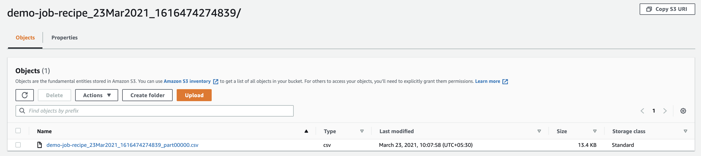

## AWS Glue Databrew

**Introduction**

- AWS Glue DataBrew is a new data preparation tool that simplifies the cleansing and normalizing the data to prepare it for analytics and machine learning for data analysts and data scientists
- It provides over 250 transformations, no-code blueprint out of the box to automate the preparation tasks. Post the data is in good shape, we can use it for analytics and ML tasks. And the pricing model is also paid for what you use - no upfront commitment.

**Tutorial**

- Step 1: Prerequisite  

  -  Download the <a href="https://github.com/sanchitdilipjain/aws-glue-databrew/blob/main/dataset.csv">dataset</a> from this link and upload it to the S3 bucket
  
  -  Download the <a href="https://github.com/sanchitdilipjain/aws-glue-databrew/blob/main/cloudformation.json">cloudformation template</a> from this link and Deploy it
  
  -  Once the Cloudformation stack is deployed successfully please capture the values for RoleName and S3Bucket details
      
       

- Step 2: Working with Glue Databrew
  
  - In this section, we will be working with AWS Glue Databrew and this section is divided into below parts
    
      - Creating a project
      - Exploring the dataset
      - Preparing the dataset
      - Creating a DataBrew job
      - Viewing data lineage

- Step 2.1: Creating a project

    1. Traverse to the AWS Glue DataBrew service

        

    2. From the DataBrew console, select Projects

        

    3. Select Create project

    4. In the Project details section, provide the project name 

        

    5. In the Select a dataset section, select New dataset and provide a name to it

        

    6. Under the Connect to a new dataset section, click Amazon S3 under “Data lake/data store”

        

    7. Under the Sampling, leave the default configuration values

        

    8. Under the Permissions section, select the role DataBrew-DataBrewLabRole--xxxxx from the drop-down list 

        

       **Note:** This role name should match the one we deployed via Cloudformation in the prerequisite section

    9. Select Create project

        

- Step 2.2: Exploring the dataset 
    
    1. After the project has been configured, we will be presented with the Grid view. In this view, the data is shown in tabular format

        
       
       The Grid view presents Columns in the dataset, different Data type of each column,a Summary of the range of values that have been found, and Statistical distribution for numerical columns

    2. Select the Schema tab. In this view, you will be presented with statistics about the data values in each column.

        
       
       The Schema view presents the checkbox next to a column to view the summary of statistics for the column values, Toggle on/off the columns, Rename columns, Change the data type of columns and Rearrange the column order
       
    3. Select the Profile tab. In this view, you can run a data profile job to examine and collect statistical summaries about the data
    
        - Select Run data profile 
        
        - Under the job details and job run sample panels, leave the default values 
         
             
        
        - Under the Job output settings section, provide the S3 bucket for storing the output 
        
        - Under the Permissions section, select the role DataBrew-DataBrewLabRole--xxxxx from the drop-down list 

             **Note:** This role name should match the one we deployed via Cloudformation in the prerequisite section
        
        - Select Create and run job
        
                
        
        - Select on Jobs from the menu on the left hand side of the DataBrew console, Select on the Profile jobs tab to view the status of the profile job
            
                
            
                
        
        - When the profile job has successfully completed, click on View data profile

                
            
            The data profile presents a summary of the rows and columns in the dataset, how many columns and rows are valid, and relationships across the columns
        
        - Select on the Column statistics tab to view a column-by-column breakdown
        
                

- Step 2.3: Preparing the dataset
  
    - In this section, we will apply the different transformations to the dataset.
    
      - Rename columns
      - Change the data type of columns
      - Filled with the most frequent value
     
    1. Download the <a href="https://github.com/sanchitdilipjain/aws-glue-databrew/blob/main/recipe.json">recipe</a> from this link
    
    2. Select on Recipe from the menu on the left-hand side of the DataBrew console and click Upload Recipe
    
        
    
    3. Provide below details
    
        - Recipe Name
        - Upload Recipe json script downloaded under Step 1
        - Select Create and publish recipe
        
         

    4. Verify the recipe 
    
          
    
    5. Now let's apply this recipe, click the project we configured now and the right side, click Import recipe 
    
          
    
    6. Under Import recipe, select the recipe we configured and click Next
    
          
    
    7. Select the Append option from the right side and click Next
    
          
    
    8. Now let's validate the recipe and wait for all validation to be successful 
    
           
    
    9. Once the validation is successful, click Import
    
           
    
    10. Now you will be back to the project screen and with the recipe implied on the dataset
    
           

- Step 2.4 : Creating a DataBrew job
  
    1. Select on Jobs from the menu on the left hand side of the DataBrew console

    2. Under the Recipe jobs tab, select on Create job
    
    3. Provide below details
    
        - Job Name
        - Job type
        - Select right dataset
        - Select right recipe

        
     
    4. Provide valid S3 output location and leave rest all default 
     
        
     
    5. Select Create and Run job
     
         
     
    6. The DataBrew job is created and the job status is Running
     
         
     
    7. Pause until the job has completed successfully
     
         
     
    8. Post the job is completed successfully, verify the output file on the S3 Output location provided 
     
          

- Step 2.5 : Viewing data lineage
 
    1. In DataBrew, navigate back to the project, select on Lineage at the top right
    
       The below view shows the origin of the data and the transformation steps that the data has been through.

        
